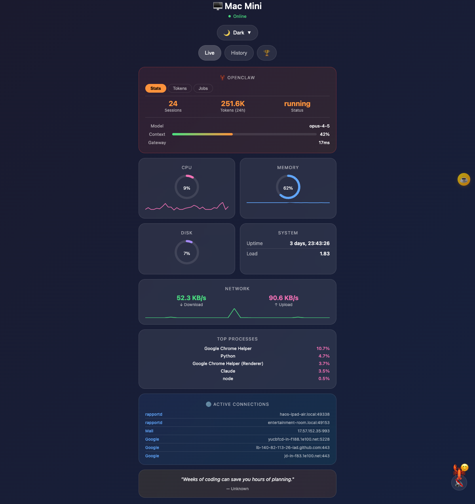

# 🖥️ System Monitor Dashboard

A beautiful, real-time monitoring dashboard for Mac, Linux, or any system — with **OpenClaw AI integration**.



## Why This Exists

**Built for [OpenClaw](https://github.com/openclaw/openclaw) users** who want to monitor their AI assistant from anywhere.

### The Problem

You're running OpenClaw on a Mac Mini (or any headless server) tucked away without a monitor. You want to:
- Check how many tokens you've used today
- See active sessions and costs
- Monitor system resources (CPU, RAM, disk)
- View scheduled jobs (cron)

But you don't want to SSH in every time just to run `openclaw status`.

### The Solution

This dashboard gives you a **single URL** to check everything — from your phone, tablet, laptop, or any device. Set it up once with Tailscale, and you can monitor your OpenClaw instance from anywhere in the world.

```
https://your-mac-mini.tailnet.ts.net
```

**Perfect for:**
- 🖥️ Headless Mac Mini / Linux server running OpenClaw
- 📱 Quick status checks from your phone
- 🌍 Remote monitoring while traveling
- 🤖 Keeping an eye on your AI assistant's token usage and costs

---

## Features

- **Real-time Monitoring**: CPU, RAM, Disk, Network with live gauges and sparklines
- **Historical Charts**: View metrics over 1H, 8H, 24H, 7D, or 30D
- **OpenClaw Integration**: Session stats, token tracking, cost estimates, scheduled jobs
- **Process Insights**: Top processes with historical comparison and anomaly detection
- **Multiple Themes**: Dark, Light, Retro CRT, Hacker, Synthwave
- **Achievements**: Fun badges for system milestones
- **Customizable Layout**: Drag & drop widgets, show/hide panels
- **Mobile Friendly**: Responsive design works on any screen
- **Larry the Lobster**: Pet mascot that reacts to CPU usage 🦞

## Platform Support

|                    | macOS         | Linux            | Windows           |
|--------------------|:-------------:|:----------------:|:-----------------:|
| **Start script**   | `./start.sh`  | `./start.sh`     | `.\start.ps1`     |
| **Glances**        | `brew`        | `apt` / `pip`    | `pip`             |
| **Tailscale**      | `brew` / App  | `apt` / script   | Installer         |
| **Service manager**| launchd       | systemd          | Task Scheduler    |
| **Collector**      | ✅            | ✅               | ✅                |
| **API Server**     | ✅            | ✅               | ✅                |
| **Dashboard**      | ✅            | ✅               | ✅                |
| **Tested**         | ✅ macOS 13+  | ✅ Ubuntu 22+    | ⚠️ Untested       |

## Requirements

- [Node.js](https://nodejs.org/) 18+
- [Python](https://python.org/) 3.8+
- [Glances](https://nicolargo.github.io/glances/) for system metrics
- [OpenClaw](https://github.com/openclaw/openclaw) (optional, for AI stats)
- [Tailscale](https://tailscale.com/) (optional, for secure remote access)

## Quick Start

### 1. Install Dependencies

| Platform | Node.js | Python | Glances |
|----------|---------|--------|---------|
| **macOS** | `brew install node` | Built-in | `brew install glances` |
| **Ubuntu/Debian** | `sudo apt install nodejs` | `sudo apt install python3` | `sudo apt install glances` |
| **Fedora/RHEL** | `sudo dnf install nodejs` | Built-in | `sudo dnf install glances` |
| **Windows** | [nodejs.org](https://nodejs.org) | [python.org](https://python.org) | `pip install glances` |

### 2. Clone & Run

```bash
git clone https://github.com/YOUR_USERNAME/claw-dash.git
cd claw-dash
```

<table>
<tr><th>macOS / Linux</th><th>Windows (PowerShell)</th><th>Windows (CMD)</th></tr>
<tr>
<td>

```bash
./start.sh
```

</td>
<td>

```powershell
.\start.ps1
```

</td>
<td>

```batch
start.bat
```

</td>
</tr>
</table>

### 3. Open Dashboard

Visit **http://localhost:8888** in your browser.

---

## Accessing the Dashboard

By default, the dashboard binds to `127.0.0.1` (localhost only) for security.

### Access Methods

| Method | Binding | URL | Security |
|--------|---------|-----|----------|
| **Localhost** | `127.0.0.1` (default) | `http://localhost:8888` | ✅ Most secure |
| **LAN** | `192.168.x.x` | `http://192.168.x.x:8888` | ⚠️ Local network only |
| **Tailscale HTTPS** | `127.0.0.1` + serve | `https://hostname.tailnet.ts.net` | ✅ Secure + remote |

---

### Option 1: Localhost Only (Default)

```bash
./start.sh   # Binds to 127.0.0.1
```
Access at `http://localhost:8888` — only works on the same machine.

---

### Option 2: LAN Access

Bind to your local IP to access from other devices on your network:

<table>
<tr><th>macOS / Linux</th><th>Windows PowerShell</th></tr>
<tr>
<td>

```bash
BIND_ADDRESS=192.168.50.2 ./start.sh
```

</td>
<td>

```powershell
$env:BIND_ADDRESS="192.168.50.2"; .\start.ps1
```

</td>
</tr>
</table>

Access at `http://192.168.50.2:8888` from any device on your LAN.

> ⚠️ **Security note:** Only use on trusted networks. Anyone on the same network can access the dashboard.

---

### Option 3: Remote Access via Tailscale (Recommended) 🌐

[Tailscale](https://tailscale.com/) provides secure, encrypted remote access with HTTPS — without exposing ports to the internet.

**1. Install Tailscale:**

| Platform | Install |
|----------|---------|
| macOS | `brew install tailscale` or [Mac App Store](https://apps.apple.com/app/tailscale/id1475387142) |
| Linux | [tailscale.com/download/linux](https://tailscale.com/download/linux) |
| Windows | [tailscale.com/download/windows](https://tailscale.com/download/windows) |
| iOS/Android | App Store / Play Store |

**2. Start dashboard (localhost):**
```bash
./start.sh   # Binds to 127.0.0.1
```

**3. Expose via Tailscale serve:**
```bash
# Expose dashboard with HTTPS
tailscale serve --bg 8888

# Check your Tailscale hostname
tailscale status
```

**4. Access from anywhere:**
```
https://your-hostname.tailnet-name.ts.net
```

> 💡 **Benefits of Tailscale serve:**
> - Automatic HTTPS certificates
> - Only authenticated Tailscale users can access
> - Works from phone, laptop, anywhere
> - No port forwarding or firewall changes needed

**Optional: Expose API too:**
```bash
tailscale serve --bg --set-path /api http://127.0.0.1:8889
```

---

### Quick Reference

| I want to... | Command | Access URL |
|--------------|---------|------------|
| Test locally | `./start.sh` | `http://localhost:8888` |
| Access from LAN | `BIND_ADDRESS=192.168.50.2 ./start.sh` | `http://192.168.50.2:8888` |
| Access anywhere (secure) | `./start.sh` + `tailscale serve --bg 8888` | `https://hostname.ts.net` |

---

## HTTPS Options

### Recommended: Tailscale Serve ⭐

The easiest way to get HTTPS. No certificates to manage, no ports to open, works from anywhere.

```bash
./start.sh                    # Start dashboard on localhost
tailscale serve --bg 8888     # Expose with automatic HTTPS
```

Done! Access at `https://your-hostname.tailnet.ts.net`

**Why Tailscale?**
- ✅ Zero configuration
- ✅ Automatic HTTPS certificates
- ✅ No port forwarding needed
- ✅ Works behind firewalls/NAT
- ✅ Only your devices can access
- ✅ Free for personal use

---

### Alternative: Caddy (Self-hosted HTTPS)

If you have a domain and want public HTTPS without Tailscale:

**1. Install Caddy:**
```bash
# macOS
brew install caddy

# Linux
sudo apt install caddy
```

**2. Create `Caddyfile`:**
```
your-domain.com {
    reverse_proxy localhost:8888
}
```

**3. Run:**
```bash
BIND_ADDRESS=127.0.0.1 ./start.sh   # Start dashboard
caddy run                            # Start Caddy (auto-fetches Let's Encrypt cert)
```

> ⚠️ Requires: Domain pointing to your server, ports 80/443 open

---

### Alternative: mkcert (LAN HTTPS)

For trusted HTTPS on your local network without a domain:

**1. Install mkcert:**
```bash
# macOS
brew install mkcert

# Linux
sudo apt install mkcert
```

**2. Create local CA and certificates:**
```bash
mkcert -install                    # Install local CA (one-time)
mkcert 192.168.50.2 localhost      # Generate cert for your IPs
```

**3. Use with a simple HTTPS server:**
```bash
# Python (requires ssl wrapper)
# Or use Caddy with the local cert:
caddy reverse-proxy --from https://192.168.50.2:8443 --to localhost:8888 \
  --internal-certs
```

> ⚠️ Each client device needs to trust the mkcert CA for this to work without browser warnings.

---

### Comparison

| Method | Setup Time | Domain Required | Works Remotely | Certificate |
|--------|------------|-----------------|----------------|-------------|
| **Tailscale** ⭐ | 2 min | No | Yes | Auto |
| **Caddy** | 10 min | Yes | Yes | Auto (Let's Encrypt) |
| **mkcert** | 15 min | No | LAN only | Self-signed (trusted) |
| **nginx + certbot** | 30 min | Yes | Yes | Auto (Let's Encrypt) |

**Our recommendation:** Use Tailscale. It's free, takes 2 minutes, and just works.

---

## Managing Services

| Action | macOS / Linux | Windows PowerShell | Windows CMD |
|--------|---------------|-------------------|-------------|
| **Start** | `./start.sh` | `.\start.ps1` | `start.bat` |
| **Stop** | `./start.sh --stop` | `.\start.ps1 -Stop` | `start.bat stop` |
| **Status** | `./start.sh --status` | `.\start.ps1 -Status` | `start.bat status` |
| **Restart** | `./start.sh --restart` | `.\start.ps1 -Restart` | `start.bat` (stop + start) |
| **Help** | `./start.sh --help` | `.\start.ps1 -Help` | `start.bat --help` |

### Custom Ports

<table>
<tr><th>macOS / Linux</th><th>Windows PowerShell</th></tr>
<tr>
<td>

```bash
DASHBOARD_PORT=3000 API_PORT=3001 ./start.sh
```

</td>
<td>

```powershell
$env:DASHBOARD_PORT=3000; $env:API_PORT=3001; .\start.ps1
```

</td>
</tr>
</table>

Default ports: Dashboard `8888`, API `8889`, Glances `61208`

## Manual Start (All Platforms)

If you prefer manual control or can't use bash:

```bash
# Terminal 1: Glances
glances -w --bind 0.0.0.0

# Terminal 2: API server
node api-server.js

# Terminal 3: Collector
python3 collector.py

# Terminal 4: Dashboard
python3 -m http.server 8888
```

## Configuration

Copy `config.example.json` to `config.json` and customize:

```json
{
  "api": {
    "port": 8889
  },
  "glances": {
    "url": "http://localhost:61208"
  },
  "features": {
    "coffeeLink": "https://buymeacoffee.com/YOUR_USERNAME",
    "showLobster": true
  }
}
```

## Running as a Service (Persistent)

### macOS (launchd)

Example plist files are in the `launchd/` folder:

```bash
# Copy and edit paths in plist files
cp launchd/*.plist.example ~/Library/LaunchAgents/
# Edit paths, then:
launchctl load ~/Library/LaunchAgents/com.dashboard.*.plist
```

### Linux (systemd)

Example service file (`/etc/systemd/system/dashboard.service`):

```ini
[Unit]
Description=System Monitor Dashboard
After=network.target

[Service]
Type=simple
User=YOUR_USER
WorkingDirectory=/path/to/claw-dash
ExecStart=/path/to/claw-dash/start.sh
Restart=on-failure

[Install]
WantedBy=multi-user.target
```

Then:
```bash
sudo systemctl daemon-reload
sudo systemctl enable dashboard
sudo systemctl start dashboard
```

## Architecture

```
┌─────────────────┐     ┌─────────────────┐     ┌─────────────────┐
│   Browser       │────▶│  Dashboard      │────▶│  API Server     │
│   (index.html)  │     │  (port 8888)    │     │  (port 8889)    │
└─────────────────┘     └─────────────────┘     └────────┬────────┘
                                                         │
                        ┌─────────────────┐              │
                        │   SQLite DB     │◀─────────────┤
                        │   (history.db)  │              │
                        └─────────────────┘              │
                                                         │
                        ┌─────────────────┐     ┌────────▼────────┐
                        │   Collector     │────▶│   Glances API   │
                        │   (collector.py)│     │   (port 61208)  │
                        └─────────────────┘     └─────────────────┘
                                                         │
                        ┌─────────────────┐              │
                        │   OpenClaw      │◀─────────────┘
                        │   (optional)    │
                        └─────────────────┘
```

## API Endpoints

| Endpoint | Description |
|----------|-------------|
| `/api/openclaw` | OpenClaw stats (sessions, tokens, cost) |
| `/api/history?range=1h` | Historical metrics |
| `/api/tokens` | Token breakdown with cost estimate |
| `/api/cron` | Scheduled jobs list |
| `/api/processes` | Process insights with anomaly detection |
| `/api/connections` | Active network connections |
| `/api/quote` | Random programming quote |

## Themes

Click the theme icon to switch between:
- 🌙 **Dark** - Easy on the eyes
- ☀️ **Light** - Bright and clean
- 📺 **Retro CRT** - Green phosphor nostalgia
- 💀 **Hacker** - Matrix-style
- 🌆 **Synthwave** - Neon vibes

## Customizing Widgets

1. Click **✏️ Edit Layout** button
2. Drag widgets to reorder
3. Toggle visibility with emoji buttons
4. Click **✓** when done
5. Click **↻ Reset** to restore defaults

Layout is saved to localStorage.

## Troubleshooting

### Glances won't start

**Check if port is in use:**
| macOS / Linux | Windows |
|---------------|---------|
| `lsof -i :61208` | `netstat -ano \| findstr :61208` |

**Try a different port:**
| macOS / Linux | Windows PowerShell |
|---------------|-------------------|
| `GLANCES_PORT=61209 ./start.sh` | `$env:GLANCES_PORT=61209; .\start.ps1` |

### Dashboard shows "Connecting..."
- Check service status:
  - macOS/Linux: `./start.sh --status`
  - Windows: `.\start.ps1 -Status`
- Check logs in `./logs/` folder

### OpenClaw card shows N/A
- OpenClaw not installed or not in PATH
- Verify installation:
  - macOS/Linux: `which openclaw`
  - Windows: `where openclaw`

### Permission denied (macOS/Linux)
```bash
chmod +x start.sh
```

### PowerShell execution policy (Windows)
```powershell
Set-ExecutionPolicy -ExecutionPolicy RemoteSigned -Scope CurrentUser
```

### Can't access remotely via Tailscale
1. Ensure Tailscale is running on **both** machines
2. Check Tailscale status: `tailscale status`
3. Verify the dashboard is bound to `0.0.0.0` (not just `localhost`)
4. Check if firewall is blocking ports 8888/8889
   - macOS: System Preferences → Security → Firewall
   - Linux: `sudo ufw allow 8888` and `sudo ufw allow 8889`
   - Windows: Allow through Windows Firewall

## Contributing

Contributions welcome! Please open an issue or PR.

## License

MIT License - See [LICENSE](LICENSE)

## Credits

- [Glances](https://nicolargo.github.io/glances/) - System monitoring
- [Chart.js](https://www.chartjs.org/) - Beautiful charts
- [SortableJS](https://sortablejs.github.io/Sortable/) - Drag & drop
- [OpenClaw](https://github.com/openclaw/openclaw) - AI gateway integration

---

Made with 🦞 by [Hao Yu](https://buymeacoffee.com/hao_yu)

If you find this useful, consider buying me a coffee! ☕
